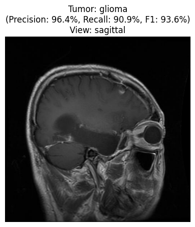
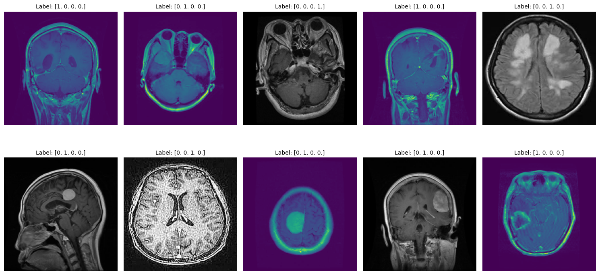
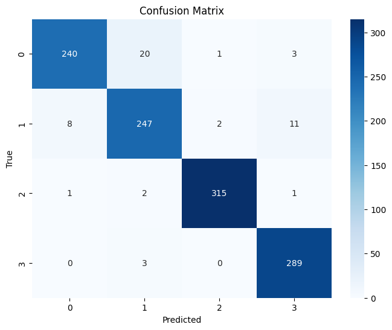
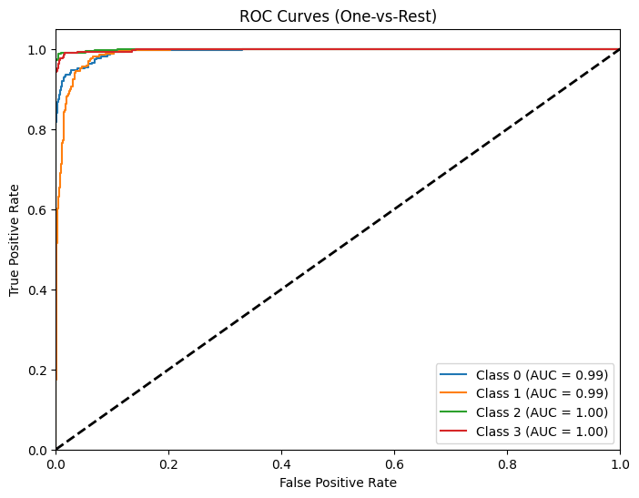
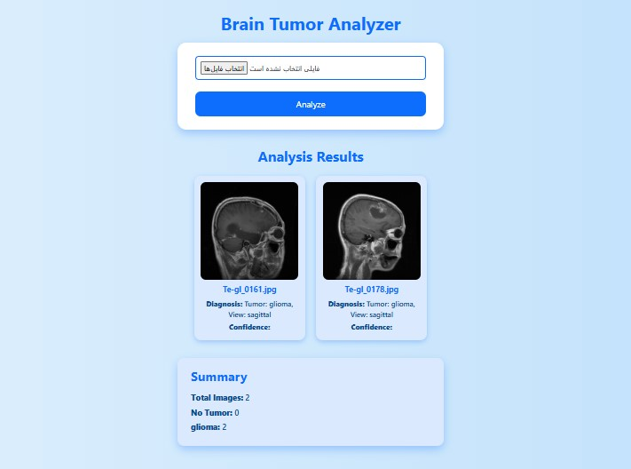

# 🧠 Brain Tumor Detection  

### Deep Learning–Based MRI Classification Using Dual-Stage CNN Architecture  

---

## 📘 Project Overview  

This project aims to automatically **detect brain tumors** from MRI images and simultaneously **classify the MRI scan view** (Axial, Coronal, Sagittal) using deep learning.  
The project consists of **two sequential models** that work together:  

1. **View Classification Model (Model 1)** — identifies the MRI view type.  
2. **Final Tumor Detection Model (Model 2)** — classifies the tumor type using both the MRI image and the extracted view features from Model 1.  

 

---

## 🧩 Model 1 — MRI View Classifier  

The **first model** was trained to recognize the **MRI orientation** of the brain scans, dividing the dataset into three categories:  

- `axial`  
- `coronal`  
- `sagittal`  

This model uses a **CNN architecture** (based on VGG16) trained on preprocessed MRI images.  
The output of this model (a 128-dimensional feature vector) was then used as an additional input to the final model to enhance its tumor classification accuracy.  

📊 **Purpose:**  
By providing view-specific information, Model 1 helps Model 2 distinguish spatial patterns better, improving overall diagnostic accuracy and robustness.  

---

## 🧠 Model 2 — Tumor Classification Model  

The **final model** integrates both raw MRI data and the **view features** from Model 1.  

### 🧮 Architecture Overview  

```

Input 1: MRI Image (128x128x3)
Input 2: View Feature Vector (128-D)
↓
VGG16 Base (pretrained on ImageNet)
↓
Flatten → Dense(128, ReLU) → Dropout(0.3)
↓
Concatenate(Image + View)
↓
Dense(128, ReLU) → Dropout(0.2)
↓
Softmax Output (4 Tumor Classes)

```

### 🎯 Target Classes  
- **Glioma**  
- **Meningioma**  
- **Pituitary Tumor**  
- **No Tumor**

The hybrid architecture combines **CNN image features** with **semantic view information**, leading to better discrimination among tumor types.  

---

## 🧠 Dataset  

This project uses a **publicly available MRI dataset** from Kaggle:  
📦 [Brain Tumor MRI Dataset — Kaggle](https://www.kaggle.com/datasets/masoudnickparvar/brain-tumor-mri-dataset)

### 📊 Dataset Composition  
| Source | Description |
|--------|-------------|
| **Figshare** | Major source for tumor images |
| **SARTAJ Dataset** | Provided initial tumor categories |
| **Br35H Dataset** | Provided *no tumor* samples |

🧾 **Dataset Details**  
- **Total Images:** 7,023  
- **Classes:** Glioma, Meningioma, Pituitary, No Tumor  
- **Views:** Axial, Coronal, Sagittal  
- **Image Sizes:** Varied → Resized to `128×128` during preprocessing  
- **Split:** Stratified Train-Test (80% / 20%)  

### 🧹 Preprocessing Steps  
- Removed duplicated and mislabeled images (esp. glioma samples in SARTAJ)  
- Verified and removed missing or corrupted files  
- Normalized all images (0–1 pixel scale)  
- Resized images to fixed resolution `(128, 128)`  
- Applied **Stratified Train-Test Split** to preserve class balance  

> 🧠 The preprocessing ensured data quality and improved generalization of the trained models.

---

## ⚙️ Training Configuration  

| Parameter | Value |
|------------|--------|
| Framework | TensorFlow / Keras |
| Optimizer | Adam (`lr=1e-4`) |
| Loss | Categorical Crossentropy |
| Epochs | 5 |
| Batch Size | 64 |
| Image Size | 128×128 |
| Split | Stratified 80/20 |
| Augmentation | Horizontal & Vertical Flip, Zoom |

---

## 📈 Performance Metrics  

|           | precision | recall | f1-score | support |
|-----------|-----------|--------|----------|---------|
| 0         | 0.96      | 0.91   | 0.94     | 264     |
| 1         | 0.91      | 0.92   | 0.91     | 268     |
| 2         | 0.99      | 0.99   | 0.99     | 319     |
| 3         | 0.95      | 0.99   | 0.97     | 292     |
| accuracy  |           |        | 0.95     | 1143    |
| macro avg | 0.95      | 0.95   | 0.95     | 1143    |
| weighted avg | 0.95   | 0.95   | 0.95     | 1143

> These metrics demonstrate strong model performance and class balance.  
> The integration of view-based features significantly improved recall and F1-score compared to using image data alone.

🧾 **Visual Results Placeholder:**  


 

---

## 🌐 Flask Web Application

A **Flask-based web interface** was built for real-time tumor prediction.
Users can upload MRI images and receive predictions for:

* Tumor Type (Glioma, Meningioma, Pituitary, No Tumor)
* MRI View (Axial, Coronal, Sagittal)
* Confidence Score for each prediction

### ▶️ Run Instructions

```bash
python back.py
```

Then open in your browser:
👉 [http://127.0.0.1:5000](http://127.0.0.1:5000)

📷 **UI Screenshot Placeholder:**





---

## 📂 Project Structure

```
Brain-Tumor-Detection/
│
├── models/
│   ├── view_classifier(s2-model1).keras
│   └── final-model-s2.keras
│
├── back.py
├── final_model+pre_s2.ipynb
├── uploads/
├── templates/
├── result_image/
└── README.md
```

---

## 🧾 Requirements

```bash
tensorflow
keras
numpy
scikit-learn
matplotlib
seaborn
flask
```

---

## 💡 Future Improvements

* Add **Grad-CAM** heatmaps for interpretability
* Extend to **3D MRI slices** with volumetric CNNs
* Integrate **segmentation models** for tumor localization
* Develop a full **Flask + React dashboard** for clinical usability
* Improve detection accuracy and fix bugs
---

## 🇮🇷 توضیحات فارسی

پروژه‌ی **Brain Tumor Detection** یک سامانه‌ی یادگیری عمیق دو مرحله‌ای برای تشخیص تومور مغزی از تصاویر MRI است.
در گام اول، مدلی برای شناسایی نوع نمای MRI (`axial`, `coronal`, `sagittal`) آموزش داده شد.
در گام دوم، مدل نهایی با استفاده از **تصویر خام و ویژگی‌های نمای استخراج‌شده از مدل اول** نوع تومور را تشخیص می‌دهد.

نتایج نشان داد که ترکیب دو ورودی باعث افزایش دقت و پایداری مدل در برابر تغییرات دید و زاویه تصویر شده است.

داده‌ها از مجموعه‌ی MRI موجود در **Kaggle** جمع‌آوری و پاک‌سازی شدند:
📦 [Brain Tumor MRI Dataset — Kaggle](https://www.kaggle.com/datasets/masoudnickparvar/brain-tumor-mri-dataset)

---

✳️ **Developed by:** Donya Forghani
📅 **Year:** 2025
📍 **Repository:** [Brain Tumor Detection](https://github.com/donyaforghani/Brain-Tumor-Detection)

```
